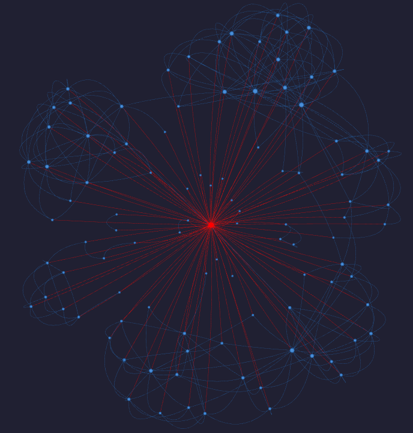
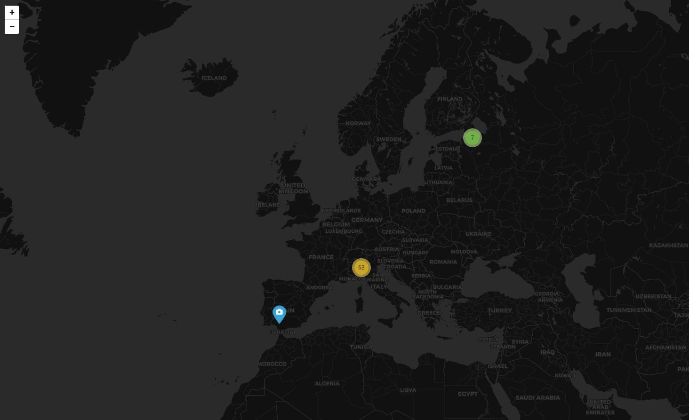

# VK OSINT

Автоматизированный сбор открытых данных о пользователях ВКонтакте через официальный [VK API](https://dev.vk.com/ru/method).

## Установка

```bash
pip install -r requirements.txt
cp .env.example .env
# Вставить VK_TOKEN в .env (сервисный ключ приложения)
```

## Использование

### Профиль пользователя с графом друзей

```bash
python main.py --user durov
python main.py --user 325100089
```

### Поиск по ФИО

```bash
python main.py --search "Павел Дуров"
python main.py --search "Иван Иванов" --city Москва --count 30
```

### Флаги

| Флаг                  | Описание                                 |
| --------------------- | ---------------------------------------- |
| `--user ID\|USERNAME` | ID или screen_name пользователя          |
| `--search "ФИО"`      | Поиск по имени                           |
| `--no-graph`          | Пропустить граф друзей                   |
| `--no-map`            | Пропустить карту геолокаций              |
| `--depth 1\|2`        | 1 = друзья, 2 = друзья друзей (медленно) |
| `--city ГОРОД`        | Фильтр по городу (для --search)          |
| `--count N`           | Кол-во результатов поиска (default: 20)  |

## Вывод

### TUI (терминал)

Таблица профиля с полями:

- Профиль (имя, ID, пол, дата рождения, город, сайт)
- Статус / О себе
- Образование (вузы, школы, карьера)
- Личная жизнь (семейное положение, родственники)
- Интересы (музыка, фильмы, книги, игры, цитаты)
- Жизненная позиция (политика, религия, курение/алкоголь)
- Статистика (подписчики, последний визит)
- Приватность (верифицирован, скрыт от поиска)

### Файлы

Создаёт папку `output/{username}_{timestamp}/`:

- **graph.html** — граф друзей (networkx + pyvis)
    - Целевой пользователь (красный узел)
    - Его друзья (синие узлы, размер по кол-ву общих знакомых)
    - Рёбра между друзьями, которые знают друг друга
    - Клик по узлу открывает профиль в ВК

- **map.html** — карта фото с геотегами (folium)
    - Кластеры маркеров по геолокации
    - Всплывающие окна с датой и ссылкой на фото

## Архитектура

```
├── api/vk_client.py          # Обёртка над VK API
├── collectors/               # Сборщики данных
│   ├── profile.py
│   ├── friends.py
│   ├── groups.py
│   ├── geo.py
│   └── search.py
├── visualization/            # Визуализация
│   ├── graph.py (networkx + pyvis)
│   └── map.py (folium)
├── report/renderer.py        # TUI вывод (rich)
├── main.py                   # CLI точка входа (argparse)
└── config.py                 # Загрузка конфига
```

## Пример использования

```bash
$ python main.py --user testuser
╭──────────────────────────╮
│ VK OSINT — Иван Петров  │
╰──────────────────────────╯

[Профиль]
  Имя                Иван Петров
  ID                 12345678
  Пол                мужской
  Дата рождения      15.7.1995
  Город/страна       Москва, Россия
  Сайт               https://example.com

[Образование / Работа]
  Текущее место      Яндекс
  Вуз                МГУ им. Ломоносова, факультет ВМК, 2017
  Школа              школа №1, 2011–2013

[Статистика]
  Подписчики         1,234
  Онлайн             Нет
  Последний визит    2026-03-09 14:50 [Android]

[Приватность]
  Закрытый профиль   Нет
  Верифицирован      Нет
  Скрыт от поиска    Нет

[Друзья]
   ━━━━━━━━━━━━━━━━━━━━ 237 друзей
  Граф сохранён: output/testuser_20260309_151144/graph.html

[Группы]  42 сообщества
  Название                     Тип     Участники
  ────────────────────────────────────────────────
  Технологии и программирование page    125,430
  Москва Live                    page     89,567
  Музыка 2000х                   page    245,821
  Путешествия                    group    12,543
  ...

[Геолокация]
  28 фото с координатами
  Карта сохранена: output/testuser_20260309_151144/map.html
```

## Граф друзей



**Описание:**
- Красный узел в центре — целевой пользователь
- Синие узлы — его друзья
- Размер узла пропорционален количеству общих знакомых с целью
- Рёбра соединяют друзей, которые знают друг друга
- Клик по узлу открывает профиль в ВК

## Карта геолокаций



**Описание:**
- Синие маркеры — фото с геотегами
- Кластеры маркеров группируются по близости
- Клик на маркер показывает дату фото и ссылку

## Примечания

- **Rate limiting:** vk-api автоматически соблюдает лимит 3 req/s
- **Закрытые профили:** API вернёт доступные поля
- **Батч-запросы:** `users.get` принимает до 1000 ID за раз
- **Токен:** Требуется сервисный ключ приложения (dev.vk.com)
